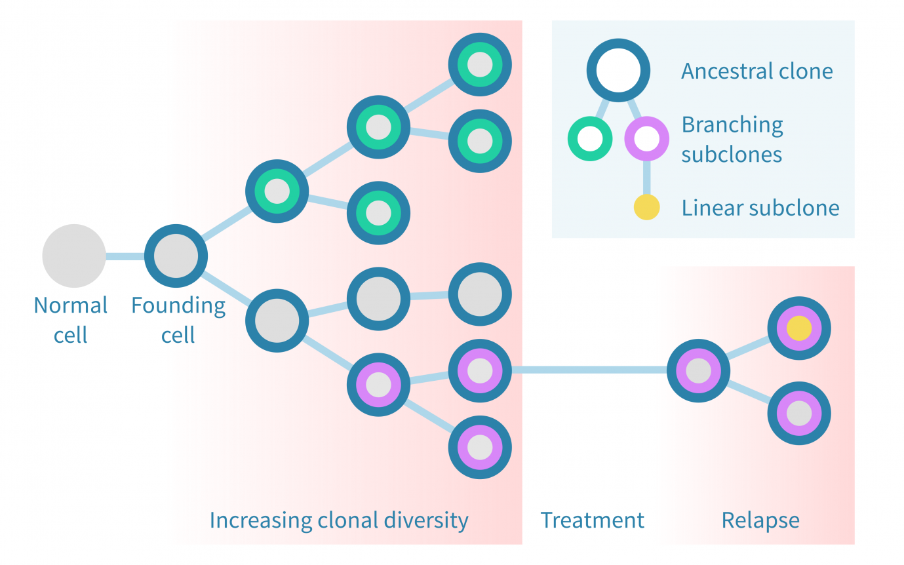
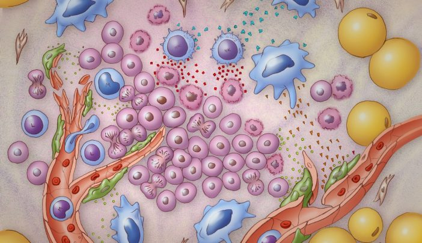
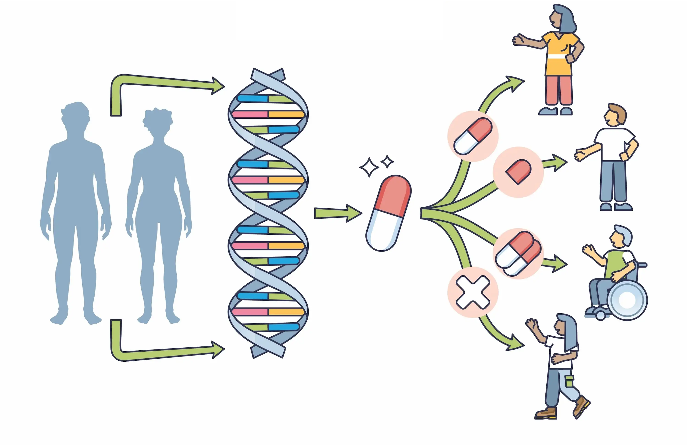

# Research

<table>
<th>
Cancer drug resistance
</th>
<tr>
<td width="50%">
Drug resistance is a major obstacle to the effectiveness of cancer treatment. Despite our tremendous efforts in developing new drugs, drug resistance is developing, probably at an even higher speed. To understand and tackle the drug resistance problem, we will focus on three questions: (a) how tumors change under therapy; (b) what are the key genetic and/or epigenetic factors causing drug resistance; (c) how to predict patient response.
</td>
<td>

</td>
</tr>
</table>

<table>
<th>
Cancer ecosystem
</th>
<tr>
<td width = "50%">
In solid tumors, cancer cells are embedded in a rich milieu of immune cells and stromal cells, forming a complex ecosystem. In addition to host cells, microorganisms such as bacteria may also reside in the tumor ecosystem. The cell interactions the ecosystem are crucial for the design of effective treatment strategies. In our lab, we aims to understand (a) what cells and species residue in human tumors; (b) how the different cells and species are organized; (c) how normal cells and non-host species impact treatment response.
</td>
<td>

</td>
</tr>
</table>

<table>
<th>
Precision medicine
</th>
<tr>
<td width="50%">
Cancer treatment has entered the precision era, in which the diagnosis and treatment are largely determined by the molecular characteristics of the tumors. To facilitate precision medicine, our lab will mine large scale, multiple omics data to (a) identify clinically relevant biomarkers for better cancer diagnosis; (b) discover novel alterations in the cancer ecosystems as potential drug targets.
</td>
<td>

</td>
</tr>
</table>
